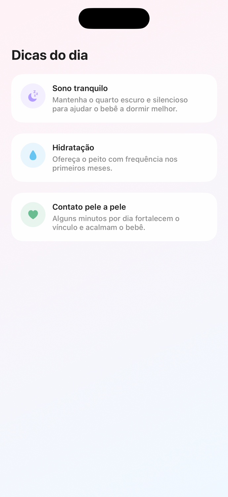

# 🎨 Wiki 04 — Criação de UI

## 🎯 Objetivo

Ao final desta wiki, você vai saber criar um **componente visual reutilizável** do zero, seguindo o padrão do projeto: dados recebidos por parâmetro (ou por um Model, em casos mais complexos), tokens de tema para cores/fontes/espaçamentos e um Preview para ver o resultado sem rodar o app inteiro.

## 📋 Pré-requisitos

- [Wiki 02 — Arquitetura e Padrões](02-Arquitetura-e-Padroes.md) (você precisa conhecer os tokens de tema).
- [Wiki 03 — Fluxo de Contribuição](03-Fluxo-de-Contribuicao.md) (a entrega desta wiki é um Pull Request).

---

## 📖 Conteúdo

### 1. O que é um componente

Um componente é um pedaço de tela reutilizável, isolado em seu próprio arquivo. Em vez de escrever o mesmo bloco visual várias vezes, você cria um componente uma vez e usa quantas vezes precisar, mudando só os dados.

No BabyTracker, os componentes de cada tela ficam em `Screens/<Feature>/Components/`. Exemplos que já existem: `SummaryCard`, `QuickActionButton`, `SettingsCard`, `TrackingCard`.

### 2. Anatomia de um componente do projeto

Vamos dissecar o `SummaryCard` (o card de resumo da Home). Ele tem duas partes:

**O Model** (`Screens/Home/Models/SummaryItem.swift`) — só os dados:

```swift
struct SummaryItem: Identifiable {
    let id = UUID()
    let title: String
    let value: String
    let detail: String
    let icon: String
    let tint: [Color]
    let tintIcon: Color
}
```

**A View** (`Screens/Home/Components/SummaryCard.swift`) — só o visual, recebendo o Model:

```swift
struct SummaryCard: View {
    let item: SummaryItem

    var body: some View {
        VStack(alignment: .leading, spacing: AppSpacing.xSmall) {
            Image(systemName: item.icon)
                .font(AppTypography.iconSmall)
                .foregroundColor(item.tintIcon)
                .frame(width: 28, height: 28)
                .background(item.tint.first ?? AppColors.surface)
                .clipShape(Circle())

            Text(item.title)
                .font(AppTypography.captionStrong)
                .foregroundStyle(AppColors.textSecondary)

            Text(item.value)
                .font(AppTypography.metricValue)
                .foregroundStyle(AppColors.textPrimary)
        }
        .padding(AppSpacing.medium)
        .frame(maxWidth: .infinity, alignment: .leading)
        .background(
            LinearGradient(colors: item.tint, startPoint: .topLeading, endPoint: .bottomTrailing)
        )
        .cornerRadius(16)
    }
}
```

Repare no padrão que o time segue:
- A View **não cria os próprios dados**; ela recebe um `item` de fora. Isso a torna reutilizável.
- **Toda cor, fonte e espaçamento vem de token** (`AppColors`, `AppTypography`, `AppSpacing`). Nenhum número mágico, nenhum `Color.gray`.
- O visual inteiro está no `body`.

### 3. Como construir um componente do zero

Vamos criar um componente novo chamado `InfoBadge`: uma etiqueta pequena com um ícone e um texto (útil para status como "Dormindo", "Acordado").

**Passo 1 — Crie o arquivo** em `Screens/Home/Components/InfoBadge.swift` (clique direito na pasta `Components` no Xcode → New File → SwiftUI View, ou New File → Swift File).

**Passo 2 — Escreva o componente recebendo os dados por parâmetro:**

```swift
import SwiftUI

struct InfoBadge: View {
    let icon: String
    let text: String
    let color: Color

    var body: some View {
        HStack(spacing: AppSpacing.xxSmall) {
            Image(systemName: icon)
                .font(AppTypography.caption)
            Text(text)
                .font(AppTypography.captionStrong)
        }
        .foregroundStyle(color)
        .padding(.horizontal, AppSpacing.small)
        .padding(.vertical, AppSpacing.xxSmall)
        .background(color.opacity(0.15))
        .clipShape(Capsule())
    }
}
```

**Passo 3 — Adicione um Preview** no fim do mesmo arquivo. O Preview mostra o componente no canvas do Xcode sem precisar rodar o app:

```swift
#Preview {
    VStack(spacing: AppSpacing.medium) {
        InfoBadge(icon: "moon.fill", text: "Dormindo", color: AppColors.accent)
        InfoBadge(icon: "sun.max.fill", text: "Acordado", color: AppColors.primary)
    }
    .padding()
}
```

**Passo 4 — Veja o Preview.** No Xcode, abra o canvas (`⌥ + ⌘ + Enter`) e clique em "Resume". Os dois badges aparecem. Ajuste o que quiser e o canvas atualiza na hora.

> 💡 O `InfoBadge` acima é só o **exemplo** para você entender o padrão. Na tarefa de treino você vai criar um componente **diferente** (o `TipCard`), aplicando os mesmos princípios — nada de copiar o `InfoBadge`.

### 4. Por que Preview em vez de rodar o app

Rodar o app inteiro só para ver um componentezinho é lento. O `#Preview` renderiza só aquela View, atualiza a cada mudança e deixa você testar vários estados de uma vez (como os dois badges acima). É a forma mais rápida de desenvolver UI em SwiftUI.

### 5. Checklist de um bom componente (padrão do time)

- Vive em `Screens/<Feature>/Components/`, um componente por arquivo.
- Recebe os dados por parâmetro (`let`), não os inventa dentro de si.
- Usa **apenas tokens** de `AppColors`, `AppTypography`, `AppSpacing` e `AppTheme`.
- Tem um `#Preview` mostrando pelo menos um estado.
- Nome em `PascalCase` que descreve o que ele é (`InfoBadge`, não `View2`).

---

## 🧪 Tarefa de treino

Sua missão é criar um componente **novo e diferente do exemplo**: o `TipCard`, um cartão de "dica" com um ícone dentro de um círculo colorido, um título e uma mensagem.

**Resultado esperado** (três `TipCard` montados numa telinha de Preview):



Passo a passo:

1. Parta da `main` atualizada e crie a branch `training/seu-nome/tip-card` (relembre o fluxo na [Wiki 03](03-Fluxo-de-Contribuicao.md)).
2. Crie o componente `TipCard` em `Screens/Home/Components/TipCard.swift`. Ele deve:
   - receber por parâmetro: um ícone (`String` de SF Symbol), um título, uma mensagem e uma cor;
   - ter o ícone dentro de um círculo com fundo colorido suave, e o título + mensagem ao lado;
   - usar **somente tokens de tema** (`AppColors`, `AppTypography`, `AppSpacing`, `AppTheme.cornerRadius`) — nada de `Color.gray`, `.font(.system(...))` ou números soltos;
   - ter um `#Preview` mostrando **pelo menos dois** `TipCard` diferentes (como na imagem).
3. Confirme no canvas do Xcode que o Preview renderiza parecido com o resultado esperado. Não precisa ficar idêntico — o que importa é seguir o padrão.
4. Commit, push e abra um PR com título começando em `[TREINO]`, anexando um print do seu Preview.

> Desafio opcional: deixe a cor do círculo e do ícone virem do mesmo parâmetro `color`, como fizemos no `InfoBadge`, para o card mudar de cor conforme a dica.

## 📬 Como entregar

A entrega é o seu **Pull Request de treino**. Cole o link do PR num comentário na Issue **"[iOS] Entrega — Wiki 04: Criação de UI"**. O feedback vem como code review no PR.

## ✅ Checklist de conclusão

- [ ] Criei o `TipCard` em `Screens/Home/Components/TipCard.swift`, em arquivo próprio
- [ ] O componente recebe ícone, título, mensagem e cor por parâmetro
- [ ] Usei só tokens de tema (nenhuma cor, fonte ou espaçamento hardcoded)
- [ ] Adicionei um `#Preview` com pelo menos dois `TipCard`
- [ ] Abri um PR `[TREINO]` com print do Preview

**Próxima parada:** Wiki 05 — Nova Funcionalidade *(em breve)*, onde você junta tudo (Model, ViewModel, Components e View) para criar uma tela completa do zero.
