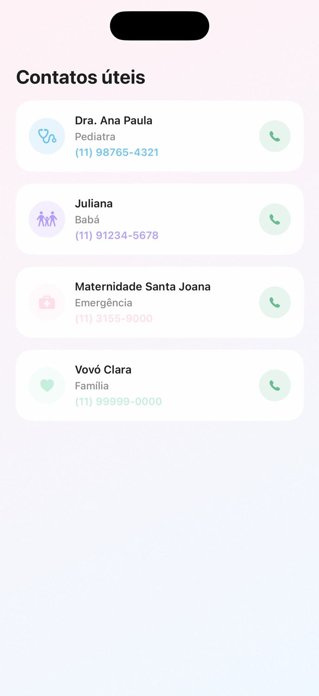

# 🚀 Wiki 05 — Nova Funcionalidade

## 🎯 Objetivo

Este é o seu projeto final de onboarding. Você vai criar uma **tela completa do zero**, juntando tudo o que aprendeu — Model, ViewModel, Component e View — e vai **integrá-la ao app**, registrando-a como uma nova aba. Ao terminar, você terá feito o que qualquer contribuição de feature exige neste projeto.

## 📋 Pré-requisitos

- Wikis 02 (arquitetura), 03 (fluxo de contribuição) e 04 (criação de UI) concluídas. Esta wiki usa tudo junto.

---

## 📖 Conteúdo

### 1. A ordem de construção de uma feature

Toda tela nova do app é montada na mesma sequência. Construir nesta ordem evita ficar preso:

1. **Model** — defina que dados a tela exibe (um `struct` simples).
2. **ViewModel** — crie a classe que guarda a lista desses dados (mockados, por enquanto).
3. **Component** — crie o pedaço visual que representa **um** item.
4. **View** — monte a tela: fundo, título e a lista de componentes.
5. **Integração** — registre a tela na `MainTabView` para ela aparecer no app.

Vamos ver cada camada usando a tela **Tracking** (a "Timeline") como exemplo. Ela já existe no projeto — abra os arquivos em `Screens/Tracking/` e acompanhe.

### 2. As 4 camadas na prática (exemplo: Tracking)

**Model** — `Screens/Tracking/Models/TrackingItem.swift`. Só dados:

```swift
struct TrackingItem: Identifiable {
    let id = UUID()
    let title: String
    let detail: String
    let time: String
    let icon: String
    let tint: Color
}
```

`Identifiable` (com o `id`) é o que permite usar o item num `ForEach`.

**ViewModel** — `Screens/Tracking/ViewModels/TrackingViewModel.swift`. Uma classe observável com a lista:

```swift
final class TrackingViewModel: ObservableObject {
    @Published private(set) var trackingItems: [TrackingItem] = [
        TrackingItem(title: "Bottle Feeding", detail: "120 ml • 15 min", time: "2:30 PM", icon: "drop.fill", tint: AppColors.highlight),
        TrackingItem(title: "Woke Up", detail: "Slept for 2h 15min", time: "2:00 PM", icon: "sun.max.fill", tint: AppColors.accent)
        // ... mais itens
    ]
}
```

Os dados são "chumbados" (mockados) direto no ViewModel. Num app real eles viriam do backend, mas para aprender a estrutura isso basta.

**Component** — `Screens/Tracking/Components/TrackingCard.swift`. Representa **um** item (você já aprendeu a fazer isso na Wiki 04):

```swift
struct TrackingCard: View {
    let item: TrackingItem
    // ... visual usando item.title, item.icon, AppColors, etc.
}
```

**View** — `Screens/Tracking/TrackingView.swift`. Junta tudo:

```swift
struct TrackingView: View {
    @StateObject var viewModel = TrackingViewModel()

    var body: some View {
        ZStack {
            LinearGradient(colors: [AppColors.backgroundTop, AppColors.backgroundBottom],
                           startPoint: .topLeading, endPoint: .bottomTrailing)
                .ignoresSafeArea()

            ScrollView {
                VStack(alignment: .leading, spacing: AppSpacing.medium) {
                    Text("Today's Timeline")
                        .font(AppTypography.screenTitle)
                        .foregroundStyle(AppColors.textPrimary)

                    ForEach(viewModel.trackingItems) { item in
                        TrackingCard(item: item, isLast: false)
                    }
                }
                .padding(AppSpacing.large)
            }
        }
    }
}
```

As três peças que ligam tudo:
- `@StateObject var viewModel = TrackingViewModel()` — a View cria e observa o ViewModel.
- `ForEach(viewModel.trackingItems) { item in ... }` — percorre a lista do ViewModel.
- `TrackingCard(item: item)` — para cada item, desenha um componente.

### 3. Integrando a tela no app (MainTabView)

Uma tela só aparece no app se estiver registrada. As abas ficam em `Screens/MainTabView.swift`:

```swift
TabView {
    HomeView()
        .tabItem { Label("Home", systemImage: "house") }

    TrackingView()
        .tabItem { Label("Tracking", systemImage: "map") }

    // ... outras abas
}
.tint(AppColors.primary)
```

Para adicionar uma tela nova, você inclui mais um bloco dentro do `TabView`:

```swift
    SuaNovaView()
        .tabItem { Label("Título", systemImage: "nome.do.sf.symbol") }
```

Os ícones vêm do **SF Symbols** (app gratuito da Apple, ou consulte a lista online). Exemplos: `phone`, `star`, `bell`.

---

## 🧪 Tarefa de treino (projeto final)

Crie do zero uma tela de **Contatos úteis**: uma lista com os contatos importantes para os pais (pediatra, babá, emergência, família).

**Resultado esperado:**



Passo a passo:

1. Parta da `main` atualizada e crie a branch `training/seu-nome/contatos`.
2. Crie a pasta `Screens/Contacts/` espelhando o padrão das outras features, com:
   - **`Models/ContactItem.swift`** — um `struct Identifiable` com: nome, função (ex.: "Pediatra"), telefone, ícone (SF Symbol) e uma cor (`Color`).
   - **`ViewModels/ContactsViewModel.swift`** — uma `ObservableObject` com uma lista `@Published private(set)` de pelo menos 4 contatos mockados.
   - **`Components/ContactCard.swift`** — o card de um contato (ícone num círculo colorido + nome + função + telefone), usando **só tokens de tema**.
   - **`ContactsView.swift`** — a tela: fundo em gradiente, título "Contatos úteis" e um `ScrollView` com `ForEach` sobre os contatos do ViewModel.
3. Registre a tela como uma **nova aba** na `MainTabView` (sugestão de ícone: `phone`).
4. Rode o app e navegue até a nova aba para conferir.
5. Commit, push e abra um PR com título começando em `[TREINO]`, anexando um print da sua tela rodando.

> Você não precisa deixar idêntico ao print. O que importa é: as 4 camadas separadas, dados vindos do ViewModel via `ForEach`, só tokens de tema e a aba funcionando no app.

## 📬 Como entregar

A entrega é o seu **Pull Request de treino**. Cole o link do PR num comentário na Issue **"[iOS] Entrega — Wiki 05: Nova Funcionalidade"**. O feedback vem como code review no PR.

Ao concluir esta wiki, você percorreu a trilha inteira: configurou o ambiente, entendeu a arquitetura, aprendeu o fluxo de contribuição, criou um componente e agora uma feature completa. **Bem-vindo(a) de vez ao time! 🎉**

## ✅ Checklist de conclusão

- [ ] Criei a pasta `Screens/Contacts/` com Model, ViewModel, Component e View separados
- [ ] O `ContactItem` é `Identifiable`
- [ ] O ViewModel expõe uma lista `@Published` de contatos mockados
- [ ] A View usa `@StateObject` e um `ForEach` sobre os itens do ViewModel
- [ ] Usei só tokens de tema em toda a UI
- [ ] Registrei a tela como nova aba na `MainTabView` e ela abre no app
- [ ] Abri um PR `[TREINO]` com print da tela rodando
